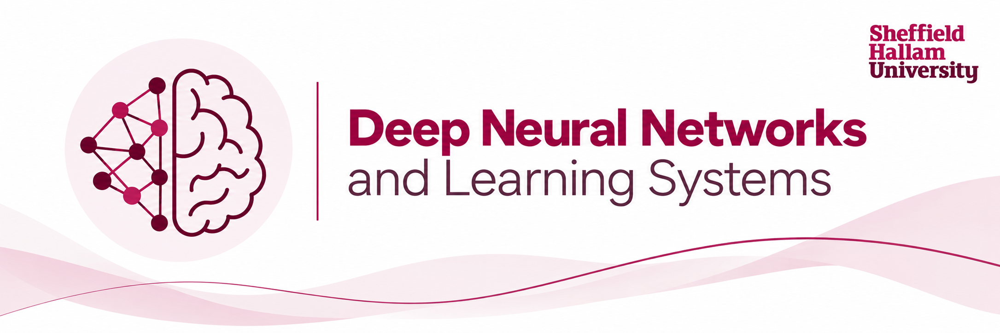

This repository contains the lecture notes and narrative exercises for the **Deep Neural Networks and Learning Systems (DNNLS)** module.

## Module rationale

DNNLS is organised around a simple idea: students should encounter deep learning as a sequence of problems to reason about, not as a catalogue of architectures to memorise. Theory, experimentation, and AI-assisted programming therefore develop together throughout the module.

The module has four closely connected parts:

1. **The architecture narrative** — [`ARCHITECTURE_NARRATIVE.md`](ARCHITECTURE_NARRATIVE.md) provides a long-range reference for the module. It follows the construction of a story-continuation system one component at a time, from simple baselines to richer neural architectures. It is not intended to dictate the weekly teaching order. Instead, it provides a concrete system against which ideas such as representation, optimisation, convolution, recurrence, attention, memory, multimodality, and learning during inference can be understood.

2. **The lecture notes** — [`lecture_notes/`](lecture_notes/) provide the theoretical spine of the module. Each week develops the mathematical and conceptual ideas needed to understand why the models and learning procedures work, where they fail, and what assumptions they make. The notes are deliberately connected to phenomena that students can observe experimentally rather than treating theory as separate from practice.

3. **The experiments and investigations** — the practical work is organised into weekly **experiments**. Each experiment poses a broader question or phenomenon and is divided into a sequence of smaller **investigations**. An investigation normally begins with a prompt, asks the student to predict or inspect something, produces code or an analysis, and ends with evidence that should refine their mental model. The aim is not simply to obtain a working implementation, but to understand what changed, what the model is doing, and why.

4. **AI-assisted learning** — generative AI sits at the centre of the practical workflow. Students are not expected to write every implementation from a blank editor. Instead, the exercises provide carefully designed prompts for **Gemini**, which acts as a programming and reasoning partner. Students ask it to construct, modify, measure, or explain an experiment, then run and interrogate the result themselves. The important skill is therefore not copying generated code, but learning how to formulate a useful computational question, inspect evidence, challenge an answer, and connect what is observed back to the theory.

The practical material is designed to be used in **Google Colab**, so that students have a common notebook environment with access to Python, PyTorch, accelerators when required, and Gemini alongside the code they are running. The notebook becomes the working record of the investigation: generated code, plots, measurements, short explanations, and the student's developing interpretation all live together.

Taken together, the intended learning loop is:

> **theory → question → AI-assisted experiment → evidence → explanation → deeper theory**

The architecture narrative gives this loop a destination; the lecture notes provide the language and mathematics; and the investigations give students repeated opportunities to discover why those ideas matter.

## Module structure

The module is organised around two parallel structures:

1. **The syllabus** — the mechanisms, models, and methods introduced week by week.
2. **The learning thread** — the deeper conceptual progression students build through experiments: sampling, projection, optimisation, representation, generalisation, inductive bias, information flow, memory, and learning during inference.

## Exercise philosophy

Exercises are designed as investigations rather than demonstrations. Each begins with a concrete question or surprising phenomenon. Students progress through a sequence of prompts that asks them to predict, run a purposeful experiment, inspect saved evidence, and revise their mental model.

The deeper learning objective is often *not directly named in the opening question*. It should emerge as the explanation the student earns from the experiment.

Whenever training is computationally expensive, the first substantial run should record enough diagnostics for later investigations to analyse the result without repeatedly retraining the model.

AI-generated code is therefore a means rather than the endpoint. The exercises should ask for code only when computation is needed, preserve useful results for later analysis, and use short explanatory responses when the important work is interpretation rather than implementation.

## Repository structure

- `ARCHITECTURE_NARRATIVE.md` — the pedagogical architecture reference that connects ideas across the module.
- `assessment/` — assessment brief, student Colab notebook, Gemini collaboration instructions, architecture-import guidance, and submission templates for the independent architecture investigation.
- `curriculum/` — module-level pedagogical design, weekly map, and conceptual progression.
- `lecture_notes/` — the LaTeX lecture notes.
  - `main.tex` — master document that assembles the full set of notes.
  - `preamble.tex` — shared packages, notation, and document-wide configuration.
  - `chapters/weekXX.tex` — one independent source file per teaching week/chapter.
- `weeks/` — weekly experiment designs, Gemini prompt sequences, code, and supporting material.
- `notebooks/` — student-facing Google Colab notebooks used to carry out the investigations.
- `templates/` — common structures for lecture chapters and experiments.
- `shared/` — reusable code, figures, datasets, and utilities when needed.
- `references.bib` — shared bibliography for the lecture notes and supporting material.

## Building the lecture notes

Compile from inside `lecture_notes/` so the relative paths to chapters, figures, and the bibliography remain simple:

```bash
cd lecture_notes
latexmk -pdf main.tex
```

The notes use `biblatex` with the `biber` backend. A standard `latexmk` installation should run the required bibliography pass automatically.

Each weekly file is brought into `main.tex` with `\input{chapters/weekXX}`. Weekly development should normally edit the relevant chapter file rather than the master document.

## Development workflow

The stable course structure lives on `main`. Substantial weekly development should normally happen on a dedicated branch and be reviewed before merging. Lecture notes and exercises for the same week should be developed together so that experiments can create the need for theory, and later lecture material can formalise what students observed.
